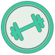

======
BYCEPS
======

BYCEPS is the Bring-Your-Computer Event Processing System.

It is **a tool to prepare and operate a LAN party**, both online on the
Internet and locally as an intranet system, for both organizers and
attendees.

The system incorporates both experience from more than 15 years of
organizing LAN parties as well as concepts and source code developed
for more than a decade.

Parties using BYCEPS:

- Since 2014, BYCEPS is the foundation of the public website and local
  party intranet of the LANresort_ (300+ attendees) event series.
- In 2016, `LANresort Bostalsee`_ was launched on BYCEPS.
- In 2017, NorthCon_ (1,300+ attendees) was relaunched on BYCEPS.

Other sites using BYCEPS:

- In 2019, the OrgaTalk_ community was launched using BYCEPS as a
  discussion board.

.. _LANresort: https://www.lanresort.de/
.. _LANresort Bostalsee: https://bostalsee.lanresort.de/
.. _NorthCon: https://www.northcon.de/
.. _OrgaTalk: https://www.orgatalk.de/

:Copyright: 2014-2022 Jochen Kupperschmidt
:License: Revised BSD (see ``LICENSE`` file for details)
:Website: https://byceps.nwsnet.de/

Code Status
===========

|badge_github-action-test|
|badge_travis-ci_build|
|badge_scrutinizer-ci_coverage|
|badge_scrutinizer-ci_quality-score|
|badge_code-climate_maintainability|

.. |badge_github-action-test| image:: https://img.shields.io/github/workflow/status/byceps/byceps/Test/main
   :alt: Build Status
   :target: https://github.com/byceps/byceps/actions/workflows/test.yml

.. |badge_travis-ci_build| image:: https://api.travis-ci.com/byceps/byceps.svg?branch=main
   :alt: Build Status
   :target: https://app.travis-ci.com/github/byceps/byceps

.. |badge_scrutinizer-ci_coverage| image:: https://scrutinizer-ci.com/g/byceps/byceps/badges/coverage.png?b=main
   :alt: Scrutinizer Code Coverage
   :target: https://scrutinizer-ci.com/g/byceps/byceps/?branch=main

.. |badge_scrutinizer-ci_quality-score| image:: https://scrutinizer-ci.com/g/byceps/byceps/badges/quality-score.png?b=main
   :alt: Scrutinizer Code Quality
   :target: https://scrutinizer-ci.com/g/byceps/byceps/?branch=main

.. |badge_code-climate_maintainability| image:: https://codeclimate.com/github/codeclimate/codeclimate/badges/gpa.svg
   :alt: Code Climate
   :target: https://codeclimate.com/github/byceps/byceps

Installation
============

See `installation instructions
<https://byceps.readthedocs.io/en/latest/installation/index.html>`_.

Testing
=======

In the activated virtual environment, install the test
dependencies:

.. code:: sh

    (venv)$ pip install -r requirements-test.txt

Run the tests:

.. code:: sh

    (venv)$ pytest

Serving
=======

To spin up a local server (only for development purposes!) for the
admin app on port 5000 with debugging middleware and in-browser code
evaluation:

.. code:: sh

    (venv)$ BYCEPS_CONFIG=../config/development.py APP_MODE=admin flask --debug run

In a production environment, it is recommended to have the application
served by uWSGI_ or Gunicorn_.

It is furthermore recommended to run it locally behind nginx_ and have
the latter both serve static files and provide SSL encryption.

.. _uWSGI: https://uwsgi-docs.readthedocs.io/
.. _Gunicorn: https://gunicorn.org/
.. _nginx: https://nginx.org/

Shell
=====

The application shell is an interactive command line that gives access to
BYCEPS' functionality as well as the persisted data.

.. code:: sh

    (venv)$ BYCEPS_CONFIG=../config/development.py flask shell

Installation of an extra package makes the shell easier to use due to features
like command history and auto-completion:

.. code:: sh

    (venv)$ pip install flask-shell-ipython
