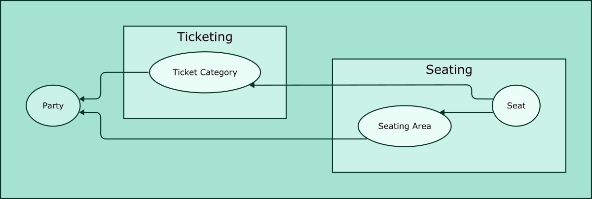
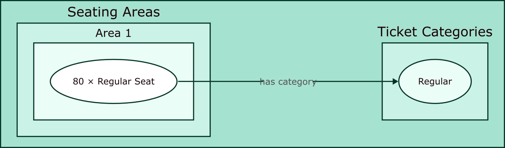
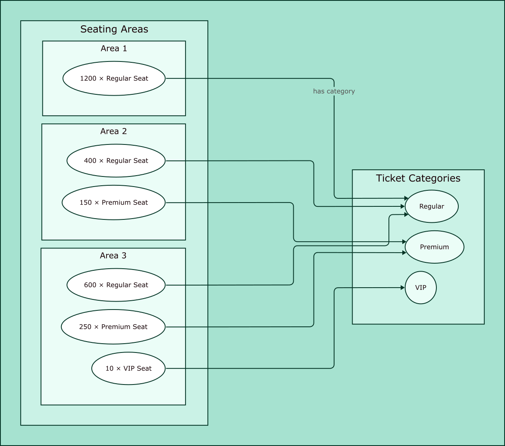

Seating
=======

BYCEPS' seating model was designed to be flexible enough to fit both
:ref:`small parties <seating-example-small>` (say, less than a hundred
seats in a single hall) as well as :ref:`big ones <seating-example-big>`
(like Northern LAN Convention – NorthCon_ – with around 3.500 seats).

.. _NorthCon: https://www.northcon.de/

Structure
---------

   Relations between entities

Each seat references these two entities:

* An **area** represents the physical location of a group of seats.

* A **category** is meant to separate seats in different price ranges
  from each another.

  Since a ticket is bound to a category, a user with a ticket from
  category X cannot reserve a seat that belongs to category Y.

Each area and category belongs to a specific party since each seating
setup often is party-specific (even if multiple parties are held in the
same location).

.. _seating-example-small:

Example: Small Party
--------------------

A small party may take place in a single room or hall, and no
distinction is made between the seats in it. Thus, a single area as well
as a single category are sufficient, so every seat belongs to the same
area and the same category.

   Small party example

.. _seating-example-big:

Example: Big Party
------------------

This is a setup for a party that is held in multiple halls and which
offers seats in multiple price (and feature) ranges.

   Big party example
