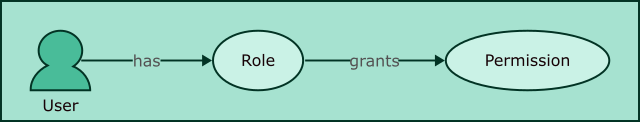
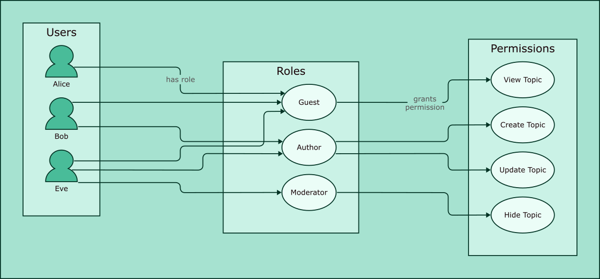

Authorization
=============

User authorization in BYCEPS is based upon permissions and roles.

Structure
---------

   Relations between entities

* A **permission** is a requirement to perform a specific action.

  A permission can be part of one or more roles.

* A **role** is a set of permissions that can be granted to users.

  Permissions can only be assigned to roles, but not directly to users.
  Roles are the links between permissions and users.

  Multiple roles may contain the same permission, but preferably
  shouldn't (see :ref:`example <authorization-example>`).

* A **user** can be assigned one or more roles through which the
  associated permissions are granted.

Rationale
---------

This design was chosen because

1. it simplifies authorizing users to do predefined sets of actions by
   leveraging and combining existing roles

2. while making it easy to customize the permissions a user should have
   by simply adding specific roles with very few permissions instead of
   having to copy and slightly adjust entire roles with dozens of
   permissions (as it would be required in a system that only allows to
   assign a single role to a user).

.. _authorization-example:

Example
-------

This example demonstrates how board-related permissions can be grouped
into roles. Those roles are then combined per user to provide the
permissions that should be granted.

   Example

As a result, the users have these roles and permissions:

.. list-table::
   :header-rows: 1
   :widths: 3 7 8

   * - User
     - Roles
     - Permissions

   * - Alice
     - - Guest
     - - View Topic
   * - Bob
     - - Guest
       - Author
     - - View Topic
       - Create Topic
       - Update Topic
   * - Eve
     - - Guest
       - Author
       - Moderator
     - - View Topic
       - Create Topic
       - Update Topic
       - Hide Topic
