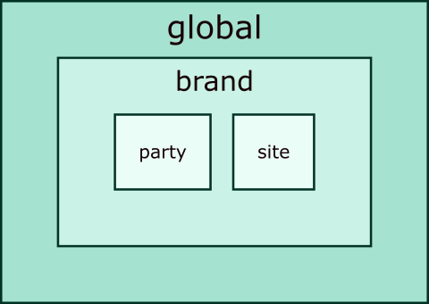

Scopes
======

BYCEPS distinguishes four scopes:

* :ref:`global <scope-global>`
* :ref:`brand <scope-brand>`
* :ref:`party <scope-party>`
* :ref:`site <scope-site>`

   Nesting of scopes

Each entity belongs to exactly one of these scopes.

.. _scope-global:

Global
------

The global scope is the outermost one.

Entities that belong to the global scope include:

- users
- roles and permissions
- user badges
- :ref:`brands <scope-brand>`
- global snippets

.. _scope-brand:

Brand
-----

A brand is the identity of a series of parties.

Each brand is part of the :ref:`global <scope-global>` scope.

Entities that belong to the brand scope include:

- email settings
- orga flags
- :ref:`parties <scope-party>`
- :ref:`sites <scope-site>`
- news channels
- boards
- brand-specific snippets
- terms of service versions

.. _scope-party:

Party
-----

The party scope is for entities that belong to a single party (and are
not better situated in the :ref:`site scope <scope-site>`).

Each party belongs to a :ref:`brand <scope-brand>`.

Entities that belong to the party scope include:

- orga teams
- shops
- tickets
- seating areas

.. _scope-site:

Site
----

The site scope is for entities and settings that belong to a specific
website.

Each site belongs to a :ref:`brand <scope-brand>`.

Entities that belong to the site scope include:

- server name
- pages
- navigation
- site-specific snippets
- choice of

  - news channels
  - forum
  - storefront
  - party

- status of

  - user registration
  - user login
